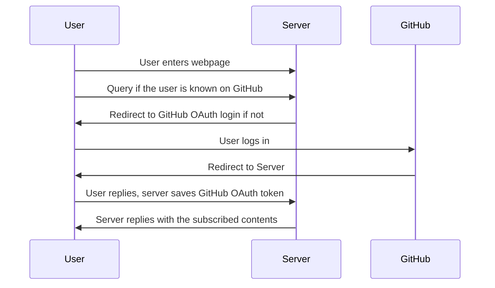

# onlygithub

GitHub Sponsors as a content subscription service provider.

## Plan

Users will log into a website with their GitHub account (authorized using OAuth
login). The server will try to detect the tier of sponsorship for the user and
grant access to the appropriate content.

The sponsors don't need to mention anything about this service in their
repositories or sponsorship tiers. Everything can be discreet if the sponsor
wants it to be.

### Flow

### Stacks

Ideally, we can use a serverless stack to minimize the cost of running this
service. The following are some options for serverless hosting:

- [Netlify](https://www.netlify.com/)
    - Known free, trustworthy
    - Definitely supporting as first-class citizen
- [Vercel](https://vercel.com/)
    - Also known to be free
    - Does it support Go? What language does it support?
- [Render](https://render.com/)
    - Seems to have decent free tiers.
        - 750h of runtime monthly (>30 days)
        - 100GB egress per free service
- [Fly](https://fly.io/)
    - Up to 3 shared VMs, 3GB persistent disk (SQLite should be fine)
    - Unsure if there's any benefit over anything else (no Nix deployment
      support)
- [Supabase](https://supabase.io/)
    - 2 free projects limit
    - What kind of stack does it support?

There are some free/cheap database options as well:

- [ElephantSQL](https://www.elephantsql.com/)
    - Known free tier, PostgreSQL (so first-class support)
    - 20MB data, should be fine for small-scale
    - 5 concurrent connections, unsafe for serverless
- [Cockroach Serverless](https://www.cockroachlabs.com/docs/stable/cockroachcloud.html)
    - 10GB of storage and 50M "RUs" per month
    - Unsure what RUs are, but 10GB is plenty
    - No credit card required and has Spend Limit, so definitely won't overcharge
    - PostgreSQL so first-class support
- [MongoDB Atlas](https://www.mongodb.com/cloud/atlas)
    - Free tier "shared", 512 MB storage (plenty, honestly)
    - Unsure how safe
    - MongoDB so automatically a downside (no ACID lol)
- [Fauna](https://fauna.com/)
    - 100k reads, 50k writes, 50k compute, 5GB storage
    - Should be plenty, but unsure
    - How predictable is the cost? Will it automatically charge me if I go over?
- [Supabase](https://supabase.io/)
    - 500MB storage, "pauses" after 1wk, 2GB egress
    - What does "pauses" mean?
- [Render](https://render.com/)
    - No free database options, cheapest is $7/mo
- [Planetscale](https://planetscale.com/)
    - 5GB storage, decent limit
    - MySQL so might not be prioritized

We'll also support hosting on regular servers. There will be Nix services for
this as well.

### Frontend

The frontend will likely be templated using Go's built-in templating engine.
Because the project is meant to be self-hosted by the individual sponsors,
there will be no built-in customization. There will be HTML pages for
modifications, however they will require forking. This might change in the
future.

### Backend

The backend will be in Go. Not much is needed here.

### Database

The database will store user information and their sponsorship tiers. It will
also store the OAuth tokens for GitHub. The database can be a simple key-value
storage if needed.

A few options that we will try to support:

- SQLite3 for self-hosted/local disk backend
- PostgreSQL for serverless or scalable backend

### Asset Storage

Assets will have to be served over the backend. This ensures that the backend
has exclusive role control and can grant access to the assets as needed.

We can support several asset backends that the main backend can use:

- Local disk
- Database for serverless as a cheaper option

We might also want to consider using S3 or other cloud storage options in
addition to the ones listed above. [afero](https://github.com/spf13/afero) can
be used to abstract the filesystem for this purpose.

### Deployment

As listed above, both serverless and self-hosted options will be supported. The
following options will definitely be supported as a requirement:

- net/http, which supplies standard HTTP handlers for servers, and
- Netlify, which will sit under a package containing just functions.

For Netlify support, we want to use a package to abstract Netlify/AWS-specific
handler APIs to idiomatic net/http ones. This will allow us to support both
Netlify and self-hosted options with the same codebase.
